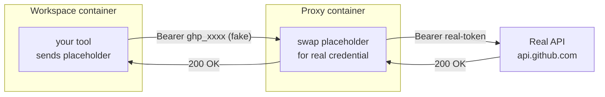

# credproxy

**Your credentials work inside a dev container without ever being inside it.**

You run tools and agents in a container: a coding assistant, a CI job, a batch
script. They need real credentials to reach GitHub, AWS, or your internal APIs.
But putting a real token inside a container you do not fully trust is risky. A
process could read it, log it, or exfiltrate it.

credproxy solves this. Your container holds only a **placeholder** — a token of
the right shape that carries no secret. A small **proxy** sits in front of the
container's network. When the container calls an approved host, the proxy swaps
the placeholder for the real credential on the way out. The tool authenticates
normally. The real secret never enters the container.



The real credential lives on your host and enters only the proxy — never the
workspace. See [How it works](docs/how-it-works.md) for the full picture.

---

## Quickstart (5 minutes)

You need a container engine (Docker or rootless Podman) and Python 3.11+. Full
setup is in the [install guide](docs/guide/01-install.md).

**1. Clone the repo and put its commands on your PATH.**

```sh
git clone https://github.com/gregclermont/credproxy.git
cd credproxy
export PATH="$PWD/bin:$PATH"
```

**2. Create a workspace.** Run this in the project directory you want to work in:

```sh
credp create myproject --here
```

**3. Start it.** The first start offers to build the proxy image. Say yes; it
takes about a minute.

```console
$ credp start
proxy image 'credproxy:dev' not found — build it now (runs docker build, ~a minute)? [Y/n] y
building proxy image 'credproxy:dev'...
...
workspace 'myproject' running
```

**4. Add a GitHub credential.** This example reads a token from a host
environment variable named `GITHUB_TOKEN` and sends it as a bearer token, but
only to `api.github.com`:

```sh
export GITHUB_TOKEN=ghp_your_real_token   # a real token, on the host
credp binding add \
    --injector bearer --provider env --secret GITHUB_TOKEN \
    --host api.github.com --env GITHUB_TOKEN
credp start                                # re-push the new credential
```

**5. Enter the workspace and prove it works.** Inside, the real token is never
present, yet the call succeeds:

```console
$ credp enter
vscode@myproject:~$ echo "$GITHUB_TOKEN"          # already set by the login shell
credproxy_AOFWLTeyzi8jUF1YTApGxjlCpXn62z
vscode@myproject:~$ curl -s -H "Authorization: Bearer $GITHUB_TOKEN" https://api.github.com/user | jq .login
"your-github-username"
```

The `GITHUB_TOKEN` inside the container is a placeholder — a login shell exports
it for you (the binding's `--env`, served from `http://proxy.local/exports.sh`).
The proxy swapped in your real token. Watch the swap happen with
`credp logs --audit`.

> [!NOTE]
> `credp` is the human command: it remembers a default workspace and adds short
> aliases. Its strict twin is `credproxy`, which names every workspace
> explicitly and never prompts — use `credproxy` in scripts. Both do the same
> work.

---

## Three doors

- **[The guide](docs/guide/01-install.md)** — start here. Install, build your
  first workspace, learn the daily rhythm, add your first credential.
- **[How it works](docs/how-it-works.md)** — the two containers, the shared
  network, the placeholder swap, and why the secret stays out of the workspace.
- **[Reference](docs/README.md)** — the full docs map: configuration, providers,
  injectors, rules, security, troubleshooting, and advanced topics.
