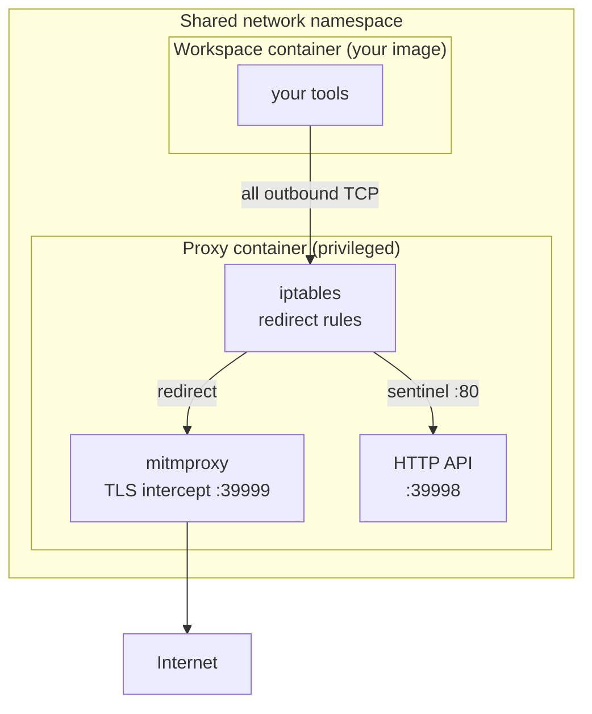
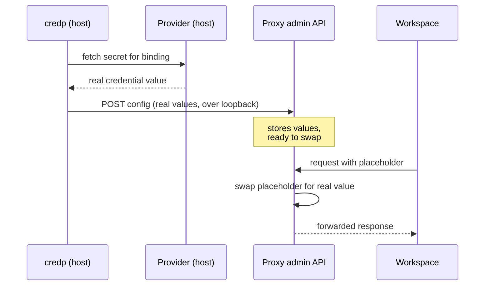

# How it works

[← docs index](README.md) · [Concepts](concepts.md)

This page explains what credproxy does under the hood, in plain language. You do
not need this to use credproxy, but it makes the behavior predictable. If a term
is new, the [concepts page](concepts.md) defines it.

## Two containers, one network

A [workspace](concepts.md#workspace) is two containers that share a single
network namespace — one private network stack between them:

1. A **proxy** container. It is privileged (it needs `NET_ADMIN` to manage the
   network), it holds your real credentials, and it runs the interception
   machinery. credproxy builds and manages it.
2. **Your** workspace container. It is your own image, run unprivileged and
   never modified. You work inside this one.

Because they share the network namespace, every packet the workspace sends
leaves through the proxy. The workspace cannot reach the internet any other way.

### The iptables redirect

The proxy installs firewall rules in the shared namespace. They quietly
redirect all outbound TCP from the workspace into the interception engine
(`mitmproxy`). Your tools do not need any proxy setting; the redirect is
transparent. One special address, a link-local "sentinel" reachable as
`proxy.local` inside the workspace, is redirected instead to a small HTTP API —
that is how the workspace fetches its setup information.

> [!NOTE]
> credproxy captures TCP only. HTTP/3 (QUIC) is dropped so tools fall back to
> TCP, and IPv6 is not handled. This keeps interception reliable rather than
> clever.

## Intercept or pass through

Not every request should be opened. credproxy decides per connection, using the
server name the client announces at the start of a TLS handshake (the SNI):

- If the host has a [binding](concepts.md#binding) or a
  [rule](concepts.md#rule), the proxy **intercepts**: it terminates TLS, inspects
  the request, and can swap in a credential.
- Otherwise it **passes through**: the encrypted bytes flow straight to the real
  server, untouched. credproxy never sees inside those connections.

This means credproxy only ever looks at traffic for hosts you have named. It is
a credential-injection boundary, not a general firewall.

## Trusting the proxy: CA bootstrap

To read an intercepted HTTPS request, the proxy presents its own certificate. For
the workspace to accept that certificate, it must trust the proxy's certificate
authority (CA). This happens once, when the container is created: a setup step
fetches the CA from `http://proxy.local/bootstrap.sh` and installs it. After
that, HTTPS to intercepted hosts works with no warnings.

> [!NOTE]
> The bootstrap runs over plain HTTP inside the shared namespace. That is safe:
> no other machine can see this private loopback network, so there is no
> eavesdropper to protect against.

## The push model: how the secret stays out

This is the core safety property. **The proxy never fetches your secrets. The
host does, and pushes the resolved values in.**

When you run `credp start` (or `apply`, or `push`):

1. The `credp` command on your host reads your bindings.
2. For each binding it runs the [provider](concepts.md#provider) — a small host
   program — to fetch the real credential value.
3. It builds the full configuration, with real values, and sends it to the
   proxy's admin API over the loopback network, authenticated with a token only
   the host can read.
4. The proxy stores the values and starts swapping placeholders for them.

The secret's whole journey is host → provider → proxy. It never passes through
the workspace container.

> [!IMPORTANT]
> Because the resolved configuration carries real secret values, the proxy's
> admin API is reachable only over the host's loopback network. There is no TLS
> on it, so a remote proxy is out of the model by design. The
> [security page](security.md) covers the threat model in full.

## Where things live

- Your credentials stay in their real home (1Password, an environment variable,
  the Keychain) and enter only the proxy, only at push time.
- The workspace holds only placeholders and the proxy's CA certificate.
- The proxy keeps its pushed configuration in memory; it is re-pushed on every
  `start`.

---

**Next:** back to [the guide](guide/01-install.md), or dig into the
[reference](README.md#reference).
